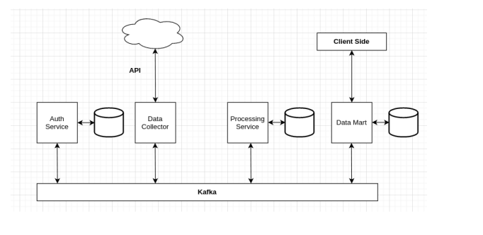

# Data Mart Service

This service holds ready data in a PostgreSQL database and provides an endpoint to retrieve the data with paging.

## Environment Variables

The following environment variables are used in this service:

- `POSTGRES_DB`: The name of the PostgreSQL database.
- `POSTGRES_USER`: The username used to authenticate with the PostgreSQL database.
- `POSTGRES_PASS`: The password used to authenticate with the PostgreSQL database.
- `POSTGRES_PORT`: The port number used to connect to the PostgreSQL database.
- `POSTGRES_HOST`: The host name or IP address used to connect to the PostgreSQL database.
- `PORT`: The port number on which the service will listen.
- `GROUP_ID`: The Kafka consumer group ID used to consume messages from the Kafka topic.
- `SERVICE_TOPIC`: The Kafka topic name from which the service will consume messages.

## Endpoints

### `GET /data`

Retrieves data from the PostgreSQL database with paging.

#### Request Parameters

- `page` (optional): The page number to retrieve. Defaults to 1 if not provided.
- `limit` (optional): The maximum number of records to retrieve per page. Defaults to 10 if not provided.

#### Response

Returns a JSON object with the following properties:

- `success`: A boolean indicating whether the request was successful.
- `data`: An array of objects representing the retrieved data.

